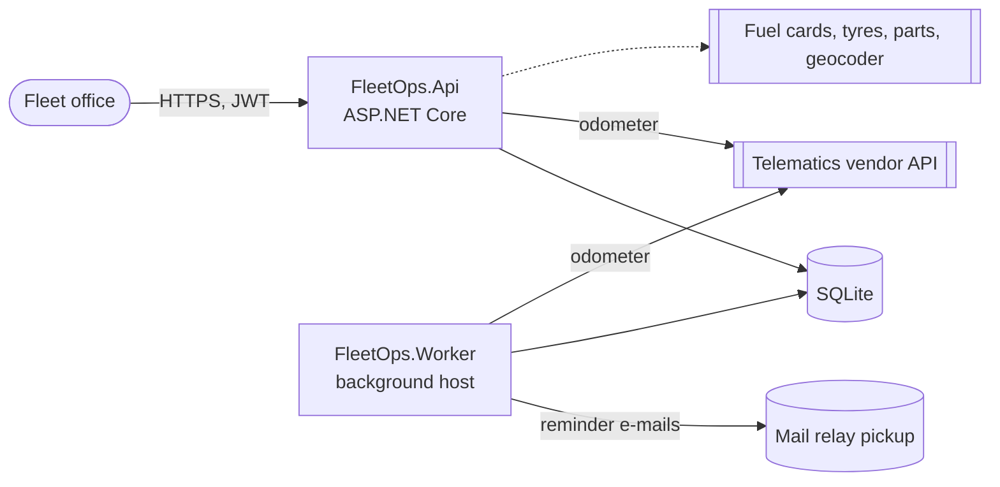
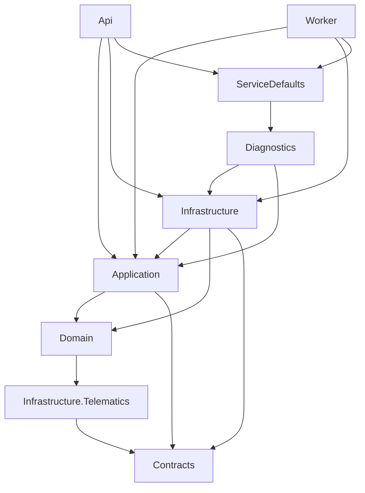

# FleetOps architecture

FleetOps keeps a company's vans and trucks on the road: it registers vehicles, opens and prices work orders, records
roadside and workshop inspections, and reminds the workshop when a vehicle is due for a service.

## Containers

## Projects

| Project | Responsibility |
|---|---|
| `FleetOps.Contracts` | Wire DTOs (ADR 0005) |
| `FleetOps.Domain` | Vehicles, work orders, inspections, the maintenance plan; repository ports |
| `FleetOps.Application` | Feature slices with Mediator handlers (ADR 0003); read-model ports; the work-order facade |
| `FleetOps.Infrastructure` | EF Core over SQLite, e-mail, documents, fuel cards, tyres, parts, geocoding, scheduling, auditing, reporting |
| `FleetOps.Infrastructure.Telematics` | Typed HTTP client for the telematics vendor |
| `FleetOps.Api` | Controllers, authentication and authorization, the composition root |
| `FleetOps.Worker` | Runs the maintenance-reminder job every hour |
| `FleetOps.ServiceDefaults` | What every host gets: clock, JSON logging, health checks |
| `FleetOps.Diagnostics` | Health checks for the database, the telematics vendor and the approval backlog |
| `FleetOps.Notifications` | Reserved for push notifications (not started) |

## Decisions

See [`adr/`](adr/): record decisions (0001), layering (0002), vertical slices (0003), thin controllers (0004),
dependency-free contracts (0005).
