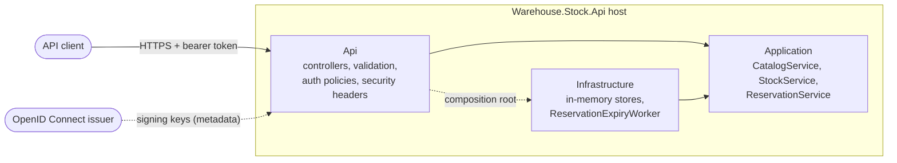

# Architecture

The service is a single deployable ASP.NET Core application split into three projects. Dependencies point inward:
the API and the infrastructure both depend on the application layer, and the application layer depends on neither
(ADR 0001). The compiler enforces this through project references.

## Request flow

1. The JWT bearer handler validates the token's signature, issuer, audience and lifetime (ADR 0003).
2. The action's named policy checks the token's `scope` claim; an authenticated-user fallback policy covers anything
   without an explicit policy. Only `/health` is anonymous.
3. `[ApiController]` validates the request model; invalid input is answered with a validation problem (400).
4. The controller calls one application service. Services return `OperationResult<T>`: a value, or an expected
   failure (`NotFound`, `Conflict`, `Invalid`) that the API maps to a problem response (404, 409, 400).

## Consistency

`IInventoryStore` runs every read and write as a callback under one lock, so a check-then-act sequence such as
"enough stock available? then reserve" is atomic. Reservations past their hold are expired by a background worker
every `Reservations:ExpirySweepInterval`, and also just before any new reservation is taken, so stock held by a lapsed
reservation is never refused to a new one.

## Data

All state lives in process memory and is lost on restart, by design (ADR 0002). No personal data is processed:
SKU codes, bin codes, zones, quantities and timestamps only.
