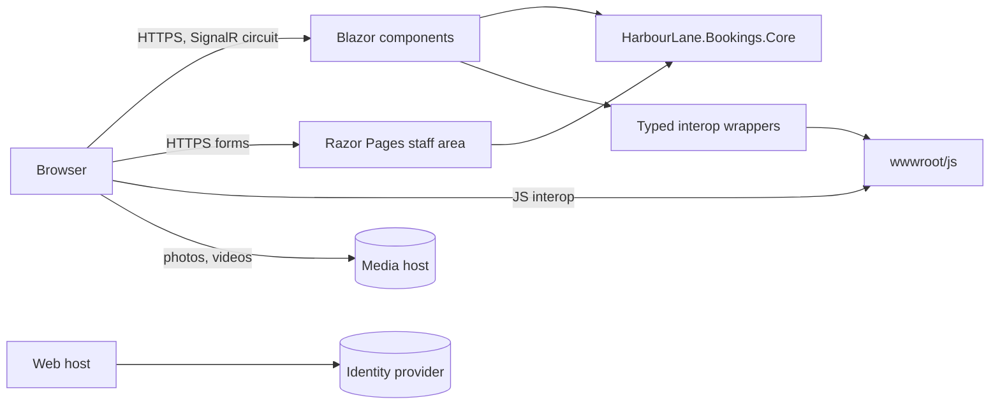

# Architecture

The portal is one ASP.NET Core application serving two UI stacks from one host: Blazor components for the public site
and member pages (interactive server rendering, prerendered on first request), and Razor Pages for the staff area.
Both read and write the same in-memory stores in the Core library.

## Request flow

1. The host applies HTTPS redirection, HSTS, the security headers and authentication.
2. Blazor routes render through `Routes.razor`; pages that need a member carry `[Authorize(Policy = "member")]`, and an
   anonymous visitor is sent to the identity provider.
3. Razor Pages under `/Admin` are authorised by folder convention with the `facilities-staff` policy.

## JavaScript interop

Interop runs after the first render (never during prerendering). The typed wrappers in `Interop/` own the function
names: the dialog module is imported once per circuit and disposed with it; the map receives a
`DotNetObjectReference` that the map component disposes. A unit test checks every name the wrappers call against
`wwwroot/js`.

## Data

Rooms are seeded from `RoomSeed`; bookings, the notice and preferences live in memory. Room descriptions and the
notice are HTML written by staff.
