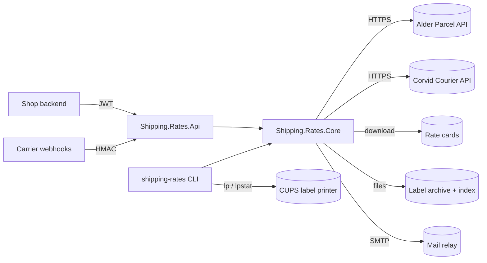

# Architecture

## Projects

| Project | Responsibility |
|---|---|
| `Shipping.Rates.Core` | Domain (`Address`, `Parcel`, `Money`, `QuoteRequest`), pricing (`RateCalculator`, `SurchargePolicy`, `MultiParcelQuoter`, `QuoteService`, `RateCardCache`), carriers (`ICarrierAdapter` and one adapter per carrier, `CarrierRegistry`), labels (`LabelService`, `ZplLabelRenderer`, `LabelArchive`). |
| `Shipping.Rates.Api` | Minimal-API endpoints, validation of the public contract, JWT bearer authentication with scope policies, security headers, health check. |
| `Shipping.Rates.Tools` | The shipping desk's CLI: rate-card import and validation, drop-folder watching, label printing through CUPS. |

## Pricing

A quote is priced from our published tariff, not from the carrier's net price: the carrier supplies which services
it can run and their transit times (see [ADR 0002](adr/0002-tariff-pricing.md)). Chargeable weight is the greater of
actual and volumetric weight; zones come from the generated `CountryZones` table.

## Carriers

Each carrier is one class implementing `ICarrierAdapter` over a typed `HttpClient`
(see [ADR 0001](adr/0001-carrier-adapters.md)). Carrier wire formats stay inside their adapter.
