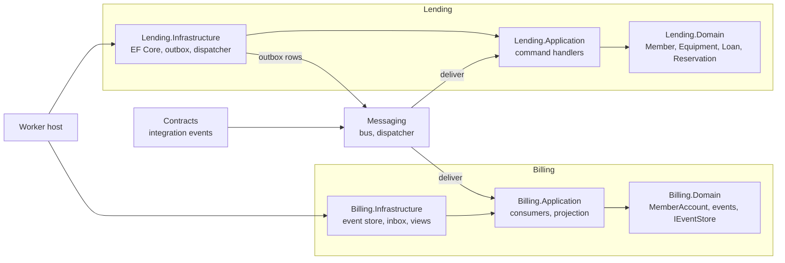

# Architecture

Two bounded contexts in one process, coupled only by integration events (and the shared kernel's `Money`).

## Flow of a loan

1. `CheckoutEquipmentHandler` opens a `Loan`; `SaveChanges` writes the loan and a `LoanOpenedIntegrationEvent` row
   to the outbox in one transaction.
2. `OutboxDispatcher` publishes committed rows in order and deletes each one once the bus accepted it. The row id is
   the message id, so a republish after a crash carries the same id.
3. Billing's `LoanOpenedHandler` holds a deposit on the member's account. It records the message id in the inbox in
   the same append as the account's events, so a redelivery is skipped.
4. On return, `LoanReturned` (and, for a damaged or lost unit, `EquipmentDamageReported`) flow the same way: Billing
   releases the deposit and charges late fees or damage, and Lending withdraws a damaged unit.
5. `ProjectionRunner` folds the event log into `AccountBalanceView` rows from its checkpoint.

## Persistence

- Lending: EF Core on SQLite, strongly-typed ids mapped with value converters, `Money` as owned types, units as an
  owned collection of `Equipment`. The schema is versioned with EF Core migrations, applied by the worker at start-up.
- Billing: an `IEventStore` with optimistic concurrency per stream; the in-memory implementation shares one lock
  between the log and the inbox (see ADR 0003).
