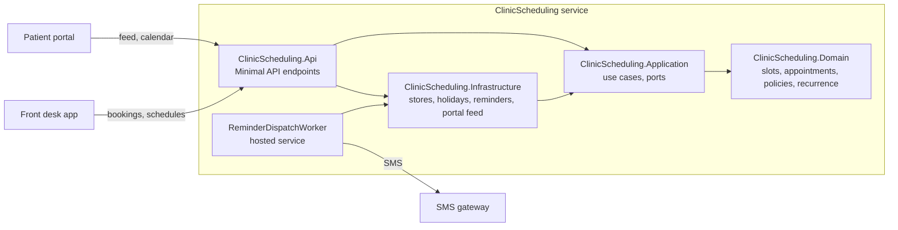

# Architecture

ClinicScheduling is a single ASP.NET Core service with a layered solution (ADR 0002). The domain holds the scheduling
rules and depends on nothing; the application layer holds the use cases and the ports they need; infrastructure
implements those ports; the API project hosts everything and is the composition root.

## Main flows

- **Find slots** - `FindSlotsHandler` loads the practitioner's schedule and booked appointments and asks `SlotFinder`
  for open slots: opening hours minus breaks, public holidays (the generated table in `Infrastructure/Holidays`),
  booked appointments with their buffers, minimum notice, the same-day cut-off and the daily cap.
- **Book, reschedule, cancel** - handlers in `Application/Booking`. Booking re-checks the requested time against
  `SlotFinder`; cancelling asks `CancellationPolicy` for the fee and whether the cancellation is a strike; two recent
  strikes require a deposit before the next booking.
- **Treatment series** - `BookTreatmentSeriesHandler` expands a recurrence rule with `RecurrenceExpander` (holidays
  move a session to the next free weekday) and books all sessions or none.
- **Reminders** - planned on booking and stored in the reminder outbox; `ReminderDispatchWorker` sends due reminders
  (ADR 0005). Texts live in `ReminderTexts` (English, Danish, German).
- **Patient portal** - the portal polls `/api/patients/{id}/feed` (JSON written by `PortalAppointmentFeed`) and
  subscribes to `/api/patients/{id}/calendar.ics` (written by `IcsCalendarWriter`).

## Decisions

See [`adr/`](adr/): record keeping (0001), layering (0002), the clock (0003, superseded by 0006), Minimal API
endpoints (0004), reminders through an outbox (0005), TimeProvider (0006).
