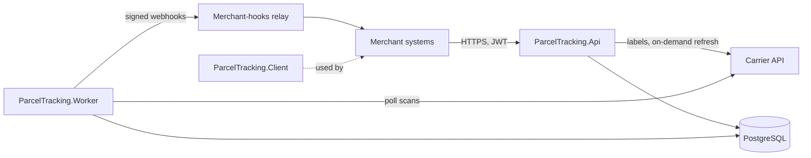

# Architecture

ParcelTracking is two processes over one PostgreSQL database, with two upstream HTTP services.

## Flow of a status change

1. The worker's `TrackingPoller` takes the active parcels polled least recently and asks the carrier API for scans
   since each parcel's last poll.
2. `TrackingService` normalises each carrier code (`CarrierStatusMap`), records the scan and, when the parcel's status
   moves forward, writes a `PendingNotification` in the same transaction (an outbox).
3. The worker's `NotificationDispatcher` posts due notifications to the merchant-hooks relay, signed with HMAC-SHA256,
   and retries failures with exponential back-off.

## Layers

`Core` holds the rules and the ports (`IParcelStore`, `ICarrierClient`, `IMerchantNotifier`); `Infrastructure`
implements them; `Api` and `Worker` are hosts. `Client` and `Cli` stand alone (the CLI uses `Core` only).

## Operability

- Health: `/health/live` (process up) and `/health/ready` (database and carrier API) on the API; the worker publishes
  its health to a heartbeat file checked by exec probes.
- Telemetry: OpenTelemetry traces, metrics and logs, exported over OTLP.
- Resilience: upstream HTTP calls go through `IHttpClientFactory` (ADR 0003).
- Schema: versioned EF Core migrations, applied by a migrations bundle before each rollout (ADR 0001).
