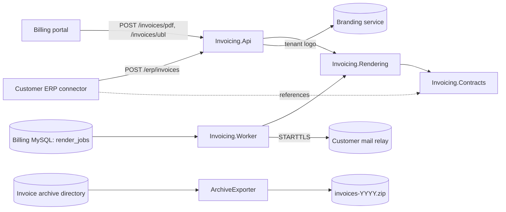

# Architecture

## Parts

- **Invoicing.Contracts** — immutable invoice model with the totals rule (amounts rounded per line). Multi-targeted
  `netstandard2.0;net10.0` because the ERP connector runs in the customer's .NET Framework 4.8 ERP host.
- **Invoicing.Rendering** — `PdfInvoiceRenderer` (PdfSharpCore, ADR 0001) lays out one A4 page; `UblInvoiceWriter`
  writes the UBL 2.1 subset the gateways read; `XmlInvoiceSigner` adds an enveloped XML-DSig signature.
- **Invoicing.Api** — ASP.NET Core controllers behind JWT bearer authentication with one scope per capability
  (`invoices.render`, `erp.submit`) and an authenticated-user fallback policy; `/health` is the only anonymous route.
  Tenant logos come from the branding service through a typed `HttpClient` with a retry handler.
- **Invoicing.Worker** — a `BackgroundService` woken by a cron schedule (Cronos). Each wake claims a batch of
  `render_jobs` rows by stamping them with the worker's instance id (ADR 0002), renders, e-mails with MailKit and
  records the outcome per job.
- **ArchiveExporter** — a command-line tool run once a year by the customer's administrator. It stamps each archived
  PDF `ARCHIVE COPY`, writes `index.csv` and packs both into one ZIP. It predates the move to .NET 10 and still
  targets .NET 6.

## Dependencies

Versions are pinned once, in `Directory.Packages.props` (Central Package Management); each project commits its
`packages.lock.json`, and CI restores with `--locked-mode`. Licences of shipped dependencies must satisfy ADR 0003.
