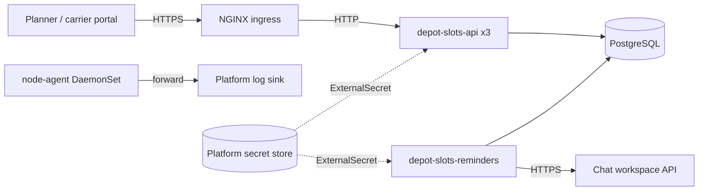

# Architecture

## Runtime

- **depot-slots-api** — the booking API. Three replicas behind a ClusterIP Service and an NGINX Ingress. Stateless;
  every write goes to PostgreSQL, whose exclusion constraint makes the no-overlap rule hold across replicas.
- **depot-slots-reminders** — one replica that polls for bookings starting within the lead time and posts them to
  the chat channel. It exposes `/health/live` and `/health/ready` on port 8080.
- **node-agent** — a Fluent Bit DaemonSet that tails this namespace's container logs and forwards them to the
  platform's log sink.
- **PostgreSQL** — a managed instance operated by the platform team, outside this repository. The API creates its
  one table on start-up (`SchemaInitializer`).

## Configuration and secrets

Settings come from `appsettings.json`, overridden per environment by `appsettings.{Environment}.json` and by
environment variables set in the manifests. The database connection string is synchronised from the platform secret
store by an `ExternalSecret`; the registry pull credential is a `SealedSecret`. Network access is default-deny in
both directions (`deploy/k8s/networkpolicy.yaml`) with one allowance per flow.

## Delivery

`ci.yml` builds and tests every push and pull request; `codeql.yml` runs code scanning. A `v*` tag runs
`release.yml`, which builds and pushes both images. `deploy.yml` is started by hand with a release tag and applies
the manifests to production through the `production` environment, which requires a reviewer's approval.
