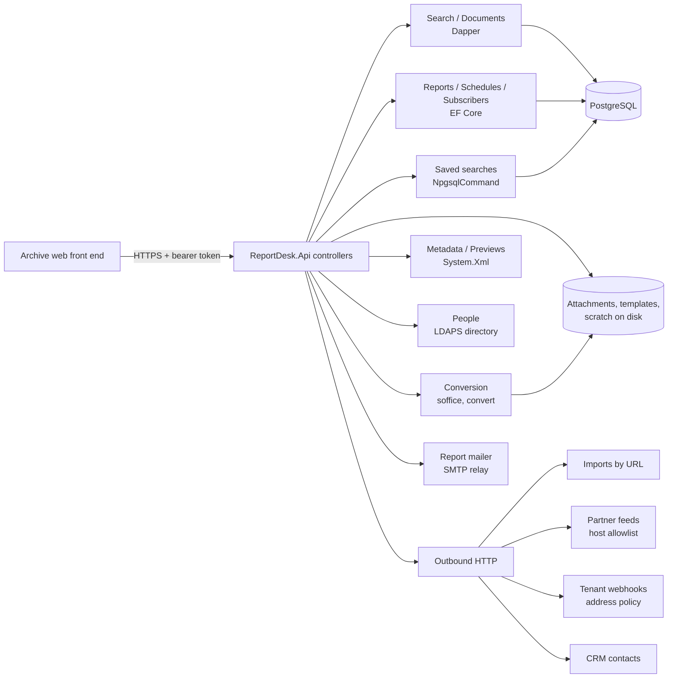

# Architecture

ReportDesk is a single ASP.NET Core service. Controllers are thin; each feature folder holds the code that does the
work and the interface its storage sits behind, so tests can replace storage with in-memory fakes.

## Request flow

1. JWT bearer authentication validates the token against the identity provider's metadata; each controller names a
   scope policy, and a fallback policy requires an authenticated user everywhere else.
2. `SecurityHeadersMiddleware` adds CSP, `X-Content-Type-Options`, frame and referrer policies; HSTS outside
   Development.
3. Request models are validated with data annotations (`[ApiController]` returns 400 on failure).

## Data

- `documents` (written by the archive's ingestion system, read here), `saved_searches`, `share_links`.
- `report_definitions`, `report_schedules`, `report_subscribers` (owned here, EF Core).

## Data retention

- Share links expire after at most 30 days; `ShareLinkCleanupJob` deletes expired links (and their password hashes)
  every six hours.
- Subscribers are kept while their subscription exists; documents and their metadata belong to the archive, whose
  retention schedule (uploaded by records management, `POST /metadata/retention`) governs them.

## Outbound calls

The partner-feed and CRM clients run behind the standard resilience pipeline (timeouts, retries with back-off, circuit
breaker); webhook and import calls are single attempts with a fixed timeout, because a retry would repeat a request a
third party sees.

## Decisions

- [ADR 0001](adr/0001-dapper-for-search-ef-core-for-reports.md) — Dapper for search, EF Core for reports.
- [ADR 0002](adr/0002-office-conversion-out-of-process.md) — LibreOffice and ImageMagick out of process.
- [ADR 0003](adr/0003-outbound-requests.md) — outbound requests per feature.
