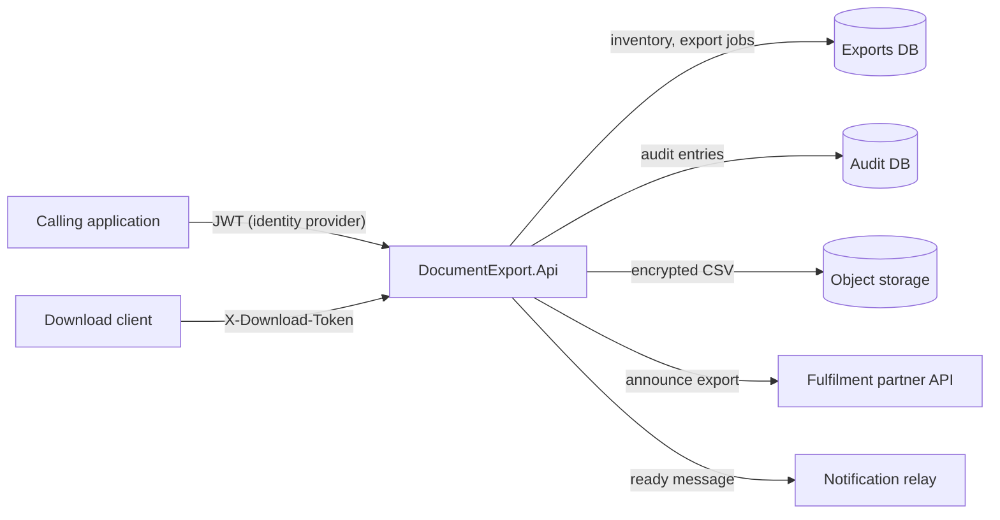

# Architecture

The service is a single deployable (`DocumentExport.Api`) with one library (`DocumentExport.Contracts`) shared with
its callers. It owns the `export_jobs` table and reads `inventory_items`; it writes to a separate audit database.

## Components

| Folder | Responsibility |
|---|---|
| `Exports/` | Endpoints, the `ExportService` workflow and CSV rendering |
| `Encryption/` | AES-256-GCM encryption of documents at rest |
| `Signing/` | RSA-PSS manifest signatures (`Keys/export-signing.pem`; consumers verify with `export-signing.pub.pem`) |
| `Tokens/` | HMAC download tokens and the `DownloadToken` authentication scheme |
| `Storage/` | S3-compatible object store client |
| `Persistence/` | Npgsql access to the exports and audit databases |
| `Partner/`, `Notifications/` | Typed HTTP clients with the standard resilience pipeline |
| `Http/` | Security response headers |

## Request flow

1. `POST /exports` (role `Exports.Write`) reads the warehouse's inventory and renders CSV.
2. The manifest (SHA-256 + signature) is computed over the plain document, the document is encrypted, uploaded and
   the job is marked `Ready`.
3. The partner and the relay are told; a failure there is logged and does not fail the export.
4. `POST /exports/{id}/download-token` issues a token scoped to the export; `GET /downloads/{id}` decrypts, checks the
   digest against the job's manifest and streams the document with `X-Content-SHA256` and `X-Manifest-Signature`.

## Strong naming

`DocumentExport.Contracts` is strong-named so that consumers which are themselves strong-named can reference it. The
public key blob (`DocumentExport.Contracts.PublicKey.snk`) is what delay-signing builds and `InternalsVisibleTo`
declarations of consumers use.
