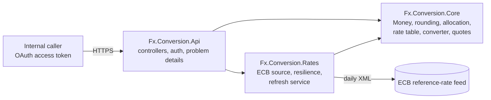

# Architecture

Fx.Conversion is a library with an HTTP host. The library holds every rule about money; the host adds transport,
security and the connection to the central bank.

## Projects

| Project | Responsibility |
|---|---|
| `Fx.Conversion.Core` | ISO 4217 catalog, `Money`, `MoneyRounding` and `CashRounding`, `Allocator`, `RateTable` and cross rates, `RateCache`, `CurrencyConverter`, `QuoteService` and its fee, store, audit and metrics ports. No I/O. |
| `Fx.Conversion.Rates` | `EcbXmlParser`, `EcbRateSource` (named `HttpClient`, Polly retry and timeout on an injected `TimeProvider`), `RateRefreshService` (hosted, `PeriodicTimer`), DI registration of the cache in front of a keyed origin source. |
| `Fx.Conversion.Api` | Controllers, request validation, JWT bearer authentication with one policy per scope, security headers, HSTS, health endpoint, exception-to-problem mapping. |

## Rates

The ECB publishes one table per working day, around 16:00 CET. `RateRefreshService` fetches it at start-up and every
`Ecb:RefreshInterval`; `RateCache` serves it for `Ecb:CacheTimeToLive` and fetches on demand when it has expired.
All rates are per euro; a rate between two other currencies is derived through the euro.

## Time

Every component that reads the clock takes a `TimeProvider` (quotes' expiry, cache age, the refresh timer, retry
back-off), so tests run on virtual time.
