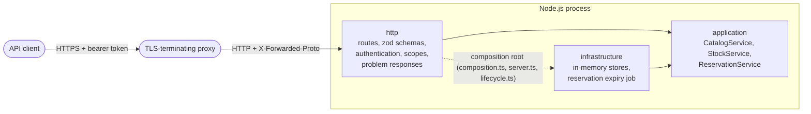

# Architecture

The service is a single Node.js process running an Express application, organised in three layers under `src/`.
Dependencies point inward: the HTTP layer and the infrastructure both depend on the application layer, and the
application layer depends on neither (ADR 0001). An ESLint `no-restricted-imports` rule enforces this.

## Request flow

1. helmet sets the security headers; pino-http logs the request with a generated request id.
2. Outside development, `/api` requests that did not arrive over HTTPS are refused (`req.secure`, which trusts the
   forwarded protocol only from the proxies named in `TRUST_PROXY`).
3. `authenticate` verifies the bearer token with jose: ES256 signature against the configured public key, issuer,
   audience and expiry (ADR 0003). A missing or invalid token is answered with 401.
4. Each route's `requireScope` checks the token's `scope` claim (403 when it lacks the scope). Only `/health` is
   anonymous.
5. The route parses its path parameters, query and body with zod; invalid input is answered with 400 and the list of
   problems.
6. The route calls one application service. Services return a `Result<T>`: a value, or an expected failure
   (`invalid`, `not-found`, `conflict`) that `sendResult` maps to a problem response (400, 404, 409).

## Consistency

The stores are synchronous and live in the same process (ADR 0002). Node.js runs JavaScript on one thread, so a
service method that makes several store calls without awaiting in between — "enough stock available? then reserve" —
cannot interleave with another request. Reservations past their hold are expired by a timer every
`RESERVATION_SWEEP_SECONDS`, and also just before any new reservation is taken, so stock held by a lapsed reservation
is never refused to a new one.

## Data

All state lives in process memory and is lost on restart, by design (ADR 0002). No personal data is processed:
SKU codes, bin codes, zones, quantities and timestamps only. The token subject is used only for the scope check and
is not stored or logged.
