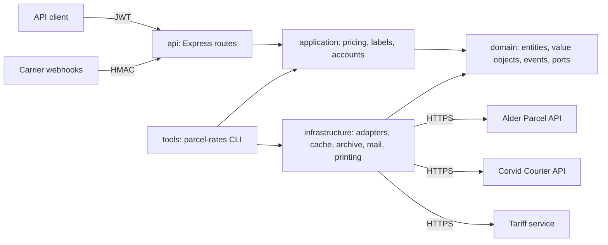

# Architecture

The parcel rates service quotes shipping rates across two carriers, creates and archives shipping labels, and offers
a command-line tool for rate-card import and label printing. See [ADR 0001](adr/0001-layered-domain-model.md) and
[ADR 0002](adr/0002-carrier-adapters.md).

## Request flow

1. `POST /api/quotes` validates the body (zod), builds value objects and asks `QuoteService`, which prices every
   carrier's rate card (`RateCalculator`, `SurchargePolicy`, generated tariff zones) and per-piece handling.
2. `POST /api/labels` hands the request to `LabelService`, which validates it, chooses the cheapest carrier unless one
   is named, asks the carrier for a label, renders ZPL when the carrier sends none, archives the file, updates the
   index and e-mails the label.
3. Carriers report tracking events to `POST /webhooks/tracking`, signed with a shared secret.

## Data

Rate cards come from the tariff service and are cached for fifteen minutes. Shipments live in memory; label files and
their index live under `LABEL_ARCHIVE_DIR` and are purged after `LABEL_RETENTION_DAYS`. Tariff zones are generated from
`data/country-zones.csv` by `tools/generate-zones.mjs`.
