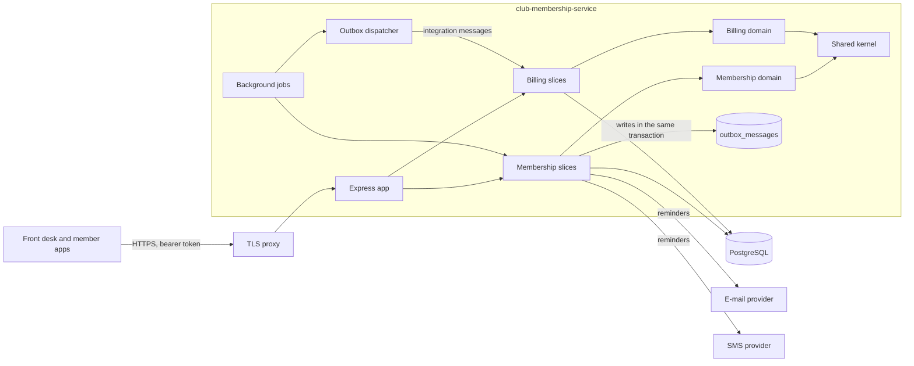

# Architecture

The club membership service is one Node.js process with two bounded contexts (ADR 0001), a shared kernel (ADR 0002)
and a platform layer for what every context needs (database, HTTP, logging, encryption, outbox).

## Contexts and slices

| Context    | Slices (`src/<context>/features/`)                                                                                                                                                   |
| ---------- | ------------------------------------------------------------------------------------------------------------------------------------------------------------------------------------ |
| Membership | register-member, change-contact-details, record-consent, schedule-class, book-class, cancel-membership, send-class-reminders, erase-member, export-member-data, purge-lapsed-members |
| Billing    | open-billing-account, anonymise-billing-account, issue-invoices, charge-late-fees, list-overdue-invoices, record-payment                                                             |

Each context's `domain/` holds its aggregates (Membership: `Member`, `ClassSession`, `ClassBooking`; Billing:
`BillingAccount`, `Invoice` with its `InvoiceLine` children), value objects and repository ports; `db/` holds the knex
implementations and the unit of work. `src/composition.ts` wires the slices and subscribes Billing to Membership's
messages; `src/app.ts` mounts the routes; `src/jobs.ts` runs the outbox dispatcher, the reminders and the retention
purge on an interval.

## Personal data

Where personal data lives, why, and for how long: [privacy/data-inventory.md](privacy/data-inventory.md). Phone
numbers and dates of birth are encrypted at field level (ADR 0004); every change to a member's personal data is
written to `audit_log` (field names only) in the same transaction; logs carry keyed pseudonyms, not identities.
