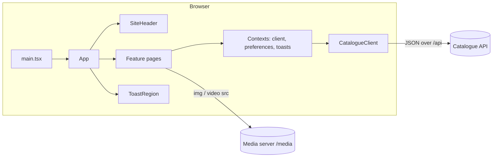

# Architecture

The catalogue is a client-side React application. Everything it shows comes from the catalogue API through one
interface, `CatalogueClient`; the media server supplies images and video by URL.

## Pages and routing

`App` reads the current path with `useRoute` and renders one feature page inside the single `<main>` element. In-app
links (`AppLink`) push a new history entry instead of reloading; `popstate` handles back and forward. After a page
change focus moves to `<main>`.

| Path                     | Page                                               |
| ------------------------ | -------------------------------------------------- |
| `/`                      | Home: hero, visiting information, opening hours    |
| `/search`, `/search/:id` | Search, with the item dialog open for `:id`        |
| `/events`                | Upcoming events and the latest storytime recording |
| `/gallery`               | Photo gallery                                      |
| `/loans`                 | The member's loans and fines                       |
| `/settings`              | Preferences                                        |

## State

- Server data is fetched per page with `AbortController` cancellation when the page or query changes.
- Preferences live in a context and are persisted to `localStorage` (`context/settings.ts`).
- Toasts are a small queue in a context (`context/toasts.ts`) rendered into a polite live region.

## Data sources

`createHttpClient('/api')` is used in production. `createDemoClient()` is an in-memory implementation of the same
interface with a few items and loans, used by `npm run dev` and by the tests (ADR 0002).
