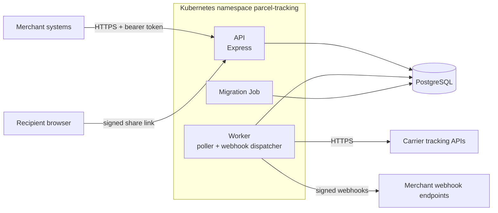

# Architecture

## Components

- **API** (`apps/tracking-service/src/http`, entry `src/api/main.ts`). Express 5 with helmet and pino-http. Merchant
  routes under `/v1` require an ES256 bearer token from the merchants' identity provider and a named scope
  (`parcels:read`, `parcels:write`); bodies and parameters are parsed with zod schemas. `/track/:trackingNumber`
  answers a recipient holding a signed, unexpired share link. `/healthz`, `/readyz` and `/.well-known/security.txt`
  are public.
- **Worker** (`src/worker`, entry `src/worker/main.ts`). Two loops: the poller asks each carrier for the events of
  every parcel that is not final and records new ones; the dispatcher delivers the webhook outbox. A small HTTP
  server serves the worker's own health endpoints. One replica (ADR 0002).
- **Parcel store** (`src/parcels`). knex over PostgreSQL. Recording carrier events, moving the parcel's status and
  queueing the merchant's webhook happen in one transaction, so a status change and its notification cannot drift
  apart.
- **Schema** (`src/db/migrations`). Versioned knex migrations, listed in order in `migrations/index.ts` and run by
  the migration Job before every rollout (ADR 0001).
- **Published packages** (`packages/*`). The merchant client and the webhook verification package. They import
  nothing from the service; the webhook signature format is the contract between the worker and the package and is
  tested end to end (ADR 0003).

## Cross-cutting

- Configuration is read once from the environment and validated; a bad configuration stops the process with the
  names of the offending variables (never their values).
- Logs are pino JSON on stdout; authorization headers are redacted.
- Every outbound call to a carrier has a per-attempt timeout and bounded retries with exponential backoff.
- Shutdown: SIGTERM stops the loops through an AbortSignal; the API drains its connections.
