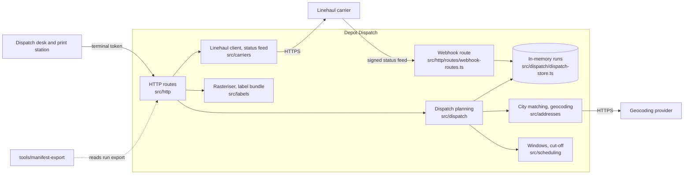

# Architecture

Depot Dispatch is one Node.js process per depot, installed on the depot's own server behind its reverse proxy. It
holds the day's dispatch runs in memory and talks to three outside parties: the depot identity service (only through
the public key that verifies its tokens), the linehaul carrier's partner API, and the geocoding provider.

## Modules

| Module                  | Responsibility                                                                    |
| ----------------------- | --------------------------------------------------------------------------------- |
| `src/http`              | Routes, request validation, terminal authentication and scopes, problem documents |
| `src/auth`              | Verification of RS256 terminal tokens                                             |
| `src/dispatch`          | The run model, the depots, route planning, the in-memory store                    |
| `src/addresses`         | Matching a typed city to the service area; locating an address                    |
| `src/scheduling`        | Departure, delivery windows, cut-off                                              |
| `src/carriers`          | The linehaul partner API (quotes, labels) and the status-feed parser              |
| `src/labels`            | Label PDF to printer PNG; the per-run label bundle                                |
| `src/webhooks`          | The carrier's Ed25519 signature                                                   |
| `tools/manifest-export` | A separate npm package: run export to CSV manifest, on the depot PCs              |

## Request flow: planning a run

1. `POST /api/runs` is authenticated (token signature, issuer, audience, expiry, `depot` claim) and scope-checked.
2. The body is validated; the depot must be the terminal's own.
3. The service date gives the departure; the depot's lead time gives the cut-off, after which the run is refused.
4. Every parcel's city is matched to the service area; parcels that match nothing are named and nothing is stored.
5. Addresses are located, parcels are grouped per city into vehicle loads, and each stop gets its window.

## Decisions

- [ADR 0001](adr/0001-depot-service-on-customer-premises.md) — one installation per depot, on the operator's server
- [ADR 0002](adr/0002-third-party-licence-policy.md) — third-party licence policy
- [ADR 0003](adr/0003-node-type-definitions-follow-the-runtime.md) — Node.js type definitions follow the runtime
- [ADR 0004](adr/0004-typescript-follows-the-linter.md) — the TypeScript compiler moves with the linter
