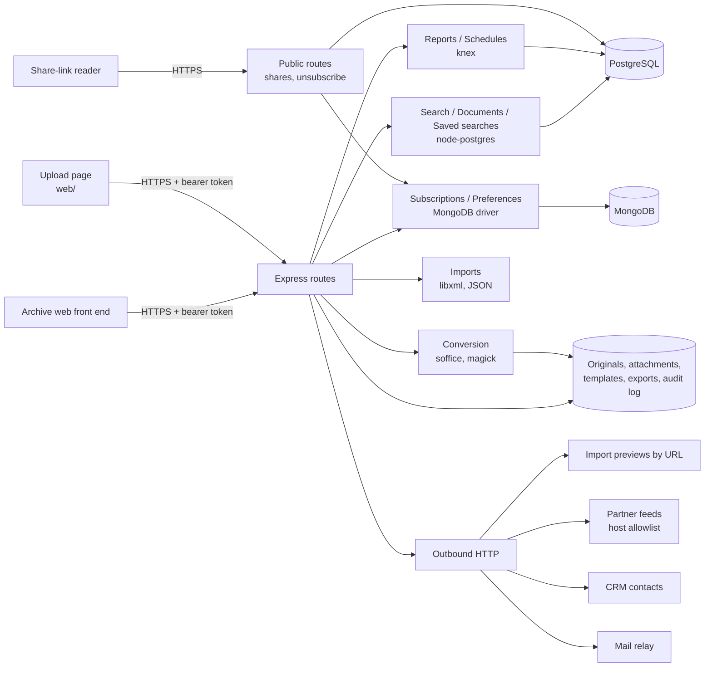

# Architecture

The Archive Search API is a single Express 5 service written in TypeScript. Code is organised by feature: each
folder under `src/` holds a feature's routes, its logic and the store it needs, behind small interfaces so tests can
replace storage and outbound calls with fakes.

## Request flow

1. pino-http logs every request with a request id (also returned as `X-Request-Id`).
2. helmet sets CSP (`default-src 'none'`), HSTS, `X-Content-Type-Options`, frame and referrer policies.
3. Outside development and tests, plain-HTTP requests are refused (`src/http/transport-security.ts`); the forwarded
   protocol is trusted only from the proxies named in `TRUST_PROXY`.
4. `/api` routes require a verified ES256 bearer token (`src/http/authentication.ts`) and the route's scope.
5. Request input is parsed with zod schemas; failures answer 400 with the problems found.

## Data

- PostgreSQL: `documents` and `document_texts` (written by the archive's ingest pipeline, read here),
  `saved_searches`, `share_links`, `exports`, `reports`, `report_schedules`.
- MongoDB: `subscriptions` (report recipients) and `preferences` (one document per user).
- Disk, below `STORAGE_ROOT`: originals, attachments, templates, export working directories and the export audit log.

## Data retention

- Share links expire after at most 30 days; a job deletes expired links (with their password hashes) every six hours.
- Subscriptions are kept while they exist and deleted on unsubscribe; delivery logs carry the address on success and
  a keyed pseudonym on bounces.

## Reports and expressions

Report previews may add computed columns written as expressions over a row, saved searches may carry a filter
expression, layouts carry cell formatters, and sorting compiles a comparator for the chosen column. These features
compile JavaScript at run time; ESLint's `no-implied-eval` reports each such site as a warning on every lint run so
they stay visible in review.

## Outbound calls

Every outbound request has a timeout. Partner feeds may only reach the hosts in `PARTNER_FEED_HOSTS`, over HTTPS,
with redirects refused. Import previews issue a `HEAD` request with a five-second timeout and return only status,
type, size and modification date. See [ADR 0003](adr/0003-outbound-requests.md).
