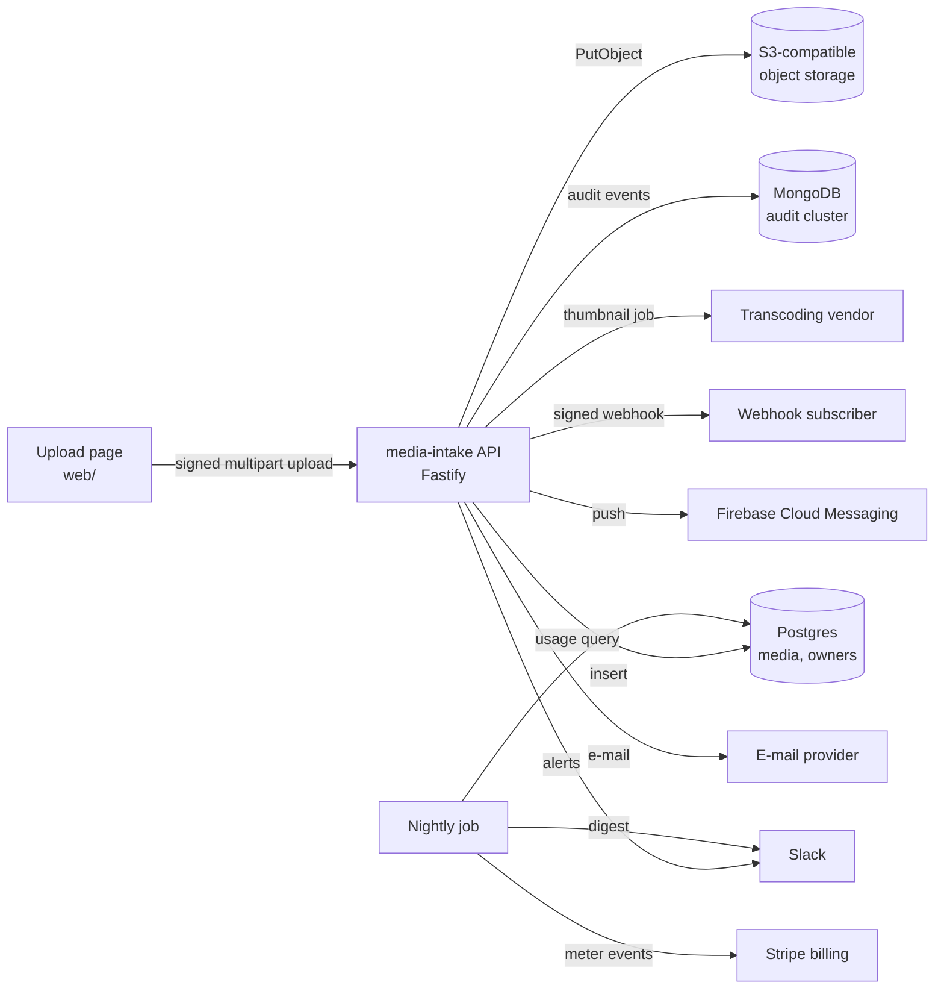

# Architecture

## Modules

| Path | Responsibility |
|---|---|
| `src/app.ts` | Fastify application: security headers, multipart limits, route registration |
| `src/server.ts` | Composition root for the API process |
| `src/nightly.ts`, `src/jobs/` | Composition root and logic of the nightly billing and digest run |
| `src/media/` | Upload acceptance, download, thumbnail requests |
| `src/auth/` | Upload request signatures (HMAC) and download tokens (HS256 JWT) |
| `src/storage/` | S3-compatible object store adapter |
| `src/db/` | Postgres pool and media repository |
| `src/audit/` | Audit trail (MongoDB, or the structured log when no cluster is configured) |
| `src/notify/` | Slack alerts and digest, e-mail, push, upload fan-out |
| `src/webhooks/` | Ed25519 signing of webhook deliveries |
| `src/billing/` | Metered usage reporting and plan upgrades |
| `web/` | The browser upload page (Vite) |

## Request flow

1. The page hashes the file, signs `<owner>.<timestamp>.<sha256>` and posts the multipart body.
2. The API verifies the signature (two-minute skew), checks the content type against an allow-list, stores the
   object under `<owner>/<day>/<uuid><ext>`, inserts the row and writes the audit event.
3. It fans the upload out (push + webhook; a failure pages operations through Slack), asks the transcoder for
   thumbnails with a short-lived download URL, and optionally e-mails the uploader.
