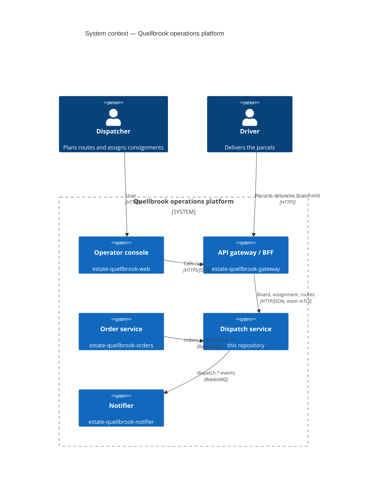
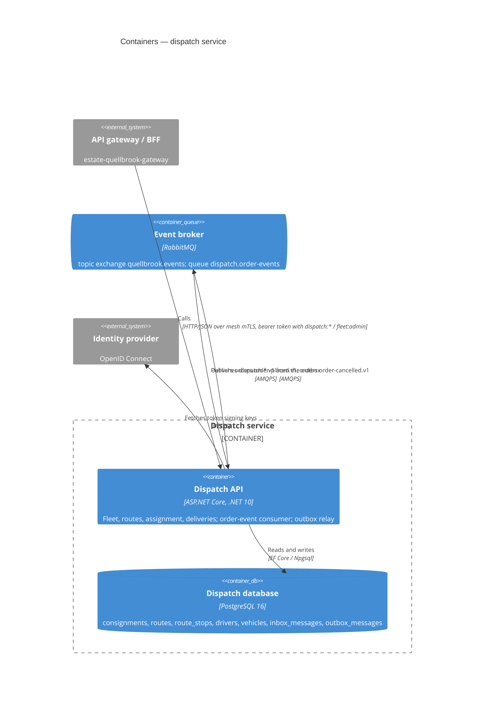
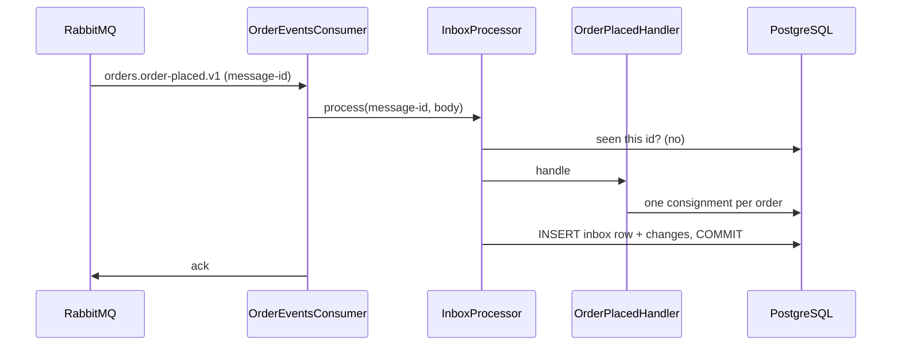

# Architecture — dispatch service

## Context

Dispatch is one of five parts of the Quellbrook operations platform. It learns about orders from the order
service's events, is driven by dispatchers through the operator console and the gateway, and tells the notifier when
parcels are on their way and delivered. Traffic between services inside the cluster goes through the Linkerd service
mesh (mutual TLS); the service listens on plain HTTP inside its pod and is reachable only from the gateway's namespace.

## Containers

## Inside the service

| Project | Responsibility | Depends on |
|---|---|---|
| `Quellbrook.Dispatch.Domain` | consignments, routes, drivers, vehicles, delivery zones, assignment policy | nothing |
| `Quellbrook.Dispatch.Contracts` | the published integration-event contracts | nothing |
| `Quellbrook.Dispatch.Application` | command handlers, the consumed-message handlers, query interfaces | Domain, Contracts |
| `Quellbrook.Dispatch.Infrastructure` | EF Core persistence and migrations, inbox, outbox and relay, RabbitMQ consumer and publisher | Application |
| `Quellbrook.Dispatch.Api` | minimal-API endpoints, authentication and authorization, hosting | Infrastructure |

Endpoints call application handlers and `IDispatchQueries` only (ADR 0002). A consumed message runs through
`InboxProcessor`: its id is recorded in the same transaction as the handler's changes (ADR 0003).

## Message contracts

| Routing key | Payload | Direction |
|---|---|---|
| `orders.order-placed.v1` | order id, service level, consignee address (postal code, country), parcel weights — dispatch's own copy of the fields it uses (`OrderPlacedMessage`) | consumed |
| `orders.order-cancelled.v1` | order id, reason, time | consumed |
| `dispatch.consignment-out-for-delivery.v1` | consignment id, order id, route id, time | published |
| `dispatch.consignment-delivered.v1` | consignment id, order id, proof (signature, photo, safe place), time | published |
