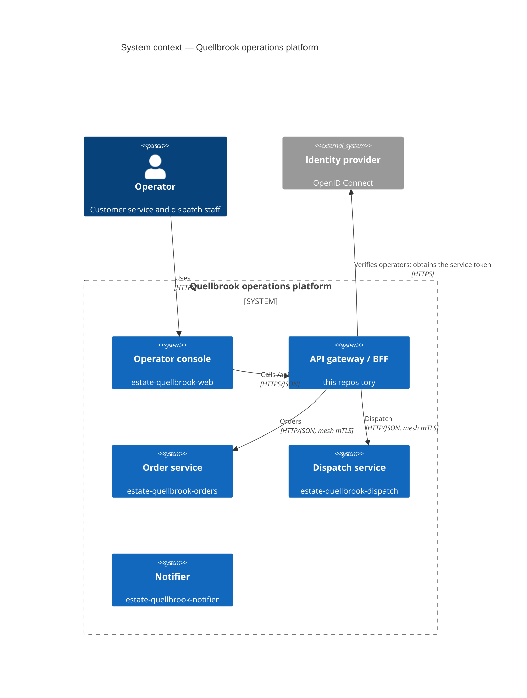
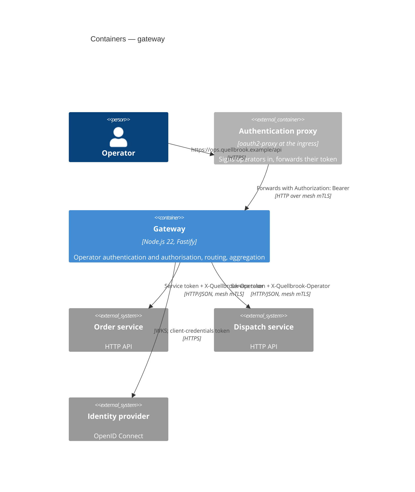

# Architecture — gateway

## Context

## Containers

Traffic inside the cluster goes through the Linkerd service mesh (mutual TLS); TLS from the browser terminates at the
ingress controller.

## Inside the gateway

| Folder          | Responsibility                                                                                 |
| --------------- | ---------------------------------------------------------------------------------------------- |
| `src/auth/`     | operator-token verification, `authenticate` and `requireScope` pre-handlers                    |
| `src/routes/`   | the `/api` routes with their JSON schemas, and the probes                                      |
| `src/upstream/` | the service token, the upstream client (timeouts, error mapping) and one typed API per service |
| `src/http/`     | problem-details responses                                                                      |

## Contracts

The gateway implements the upstream services' OpenAPI contracts, pinned in `contracts/upstream/`.
