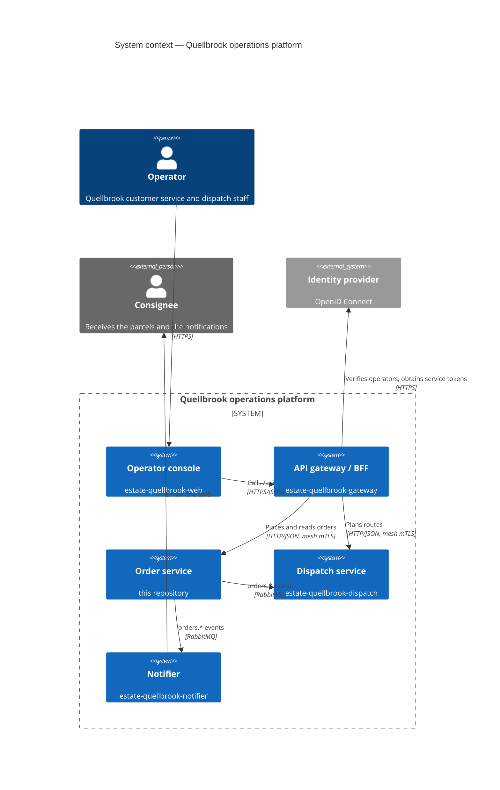
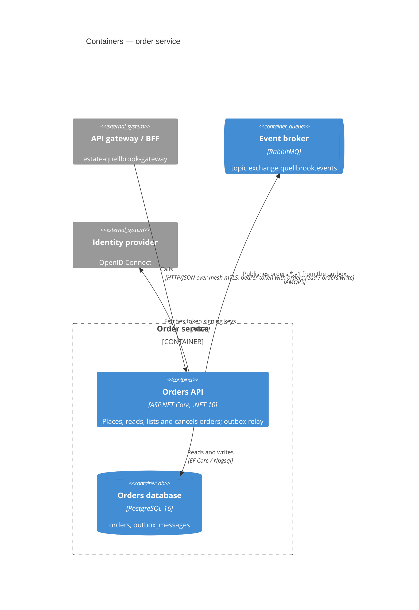
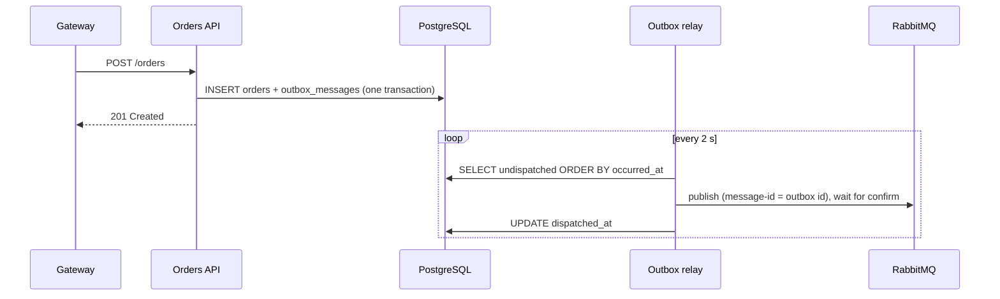

# Architecture — order service

## Context

The order service is one of five parts of the Quellbrook operations platform. Operators work in the web console;
the console calls the API gateway; the gateway calls this service with its own client credentials and forwards the
operator's id. Traffic between services inside the cluster goes through the Linkerd service mesh, which encrypts and
authenticates it with mutual TLS; the services themselves listen on plain HTTP inside their pods and are reachable
only from the namespaces their NetworkPolicies allow. Placed orders are announced on the platform's event broker.

## Containers

## Inside the service

| Project | Responsibility | Depends on |
|---|---|---|
| `Quellbrook.Orders.Domain` | the Order aggregate, its value objects and domain events | nothing |
| `Quellbrook.Orders.Contracts` | the published integration-event contracts (`OrderPlacedV1`) | nothing |
| `Quellbrook.Orders.Application` | command handlers, queries, the contract mapping | Domain, Contracts |
| `Quellbrook.Orders.Infrastructure` | EF Core persistence and migrations, the outbox and its relay, the RabbitMQ publisher | Application |
| `Quellbrook.Orders.Api` | minimal-API endpoints, authentication and authorization, hosting | Infrastructure |

The aggregate knows nothing about storage: `EfOrderRepository` maps it to an `orders` row (consignee and parcels as
JSON documents, the list's filter and sort fields as columns). When it saves, it also writes one `outbox_messages`
row per domain event the aggregate raised, in the same transaction; `OutboxRelay`, a background service in the same
process, publishes pending rows in order and marks them dispatched (ADR 0003).

## Message contracts

| Routing key | Payload | Consumers |
|---|---|---|
| `orders.order-placed.v1` | `OrderPlacedV1`: order id, customer account, service level, consignee (name, address, optional e-mail and phone), parcels | dispatch, notifier |
| `orders.order-cancelled.v1` | `OrderCancelledV1`: order id, reason, time | dispatch |

Messages are JSON, persistent, with the AMQP `message-id` set; consumers de-duplicate on it. The schemas are in
`contracts/events/` and `contracts/asyncapi.yaml`; they evolve by ADR 0004 (optional additions within a version, a new
routing key for a breaking change). Dispatched outbox rows are deleted after seven days.
