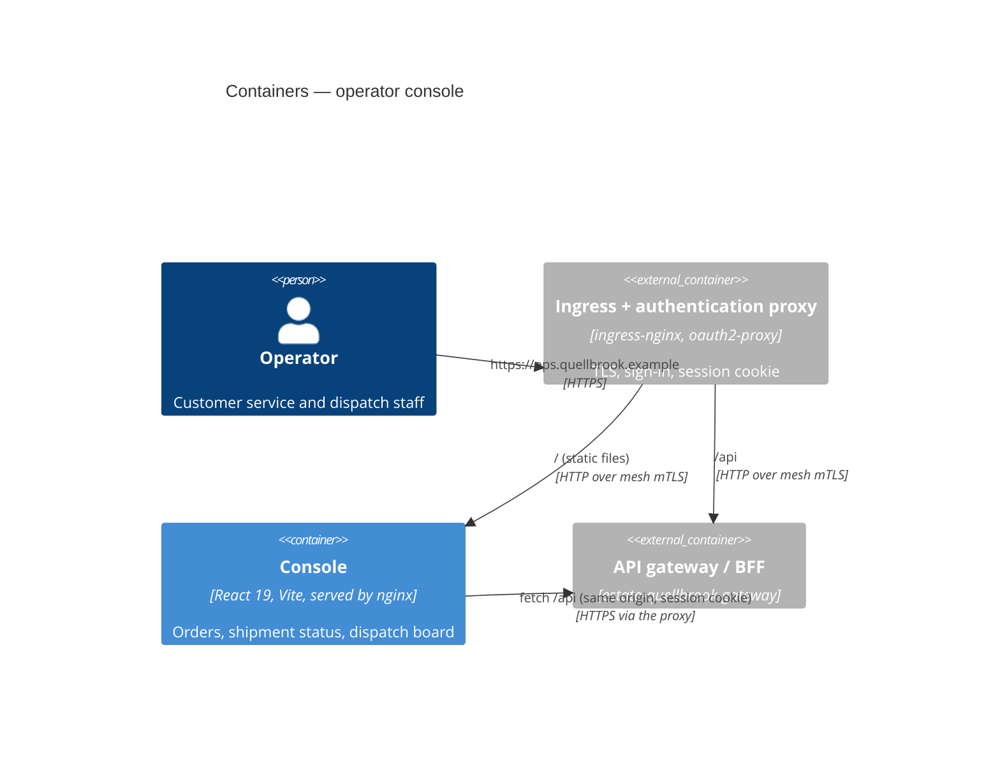

# Architecture — operator console

| Folder                             | Responsibility                                                                        |
| ---------------------------------- | ------------------------------------------------------------------------------------- |
| `src/api/`                         | the gateway client (`request`, problem details as `ApiError`) and one module per area |
| `src/features/`                    | one folder per screen                                                                 |
| `src/components/`                  | layout, links, status badge, error message                                            |
| `src/routing.ts`, `src/useLoad.ts` | path routing with the History API; loading with cancellation                          |
| `nginx/`                           | the server configuration with the security headers                                    |

The console stores no token (ADR 0002).
